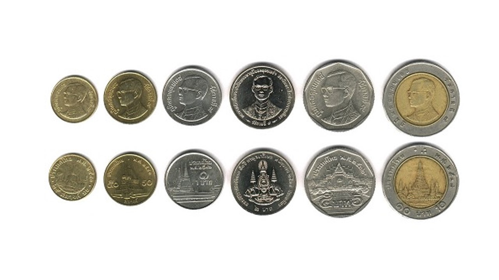
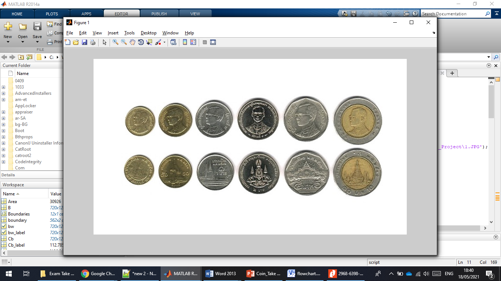
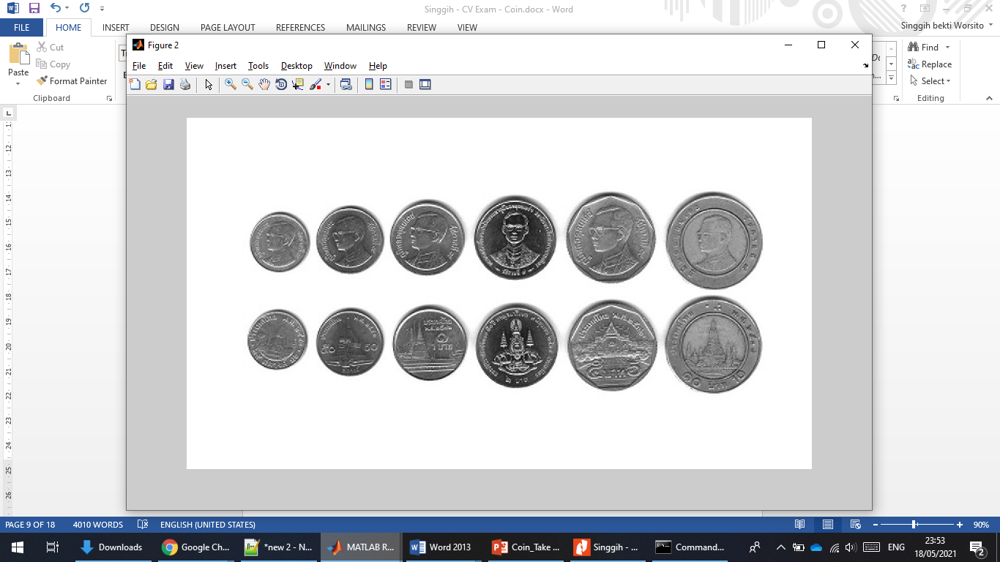
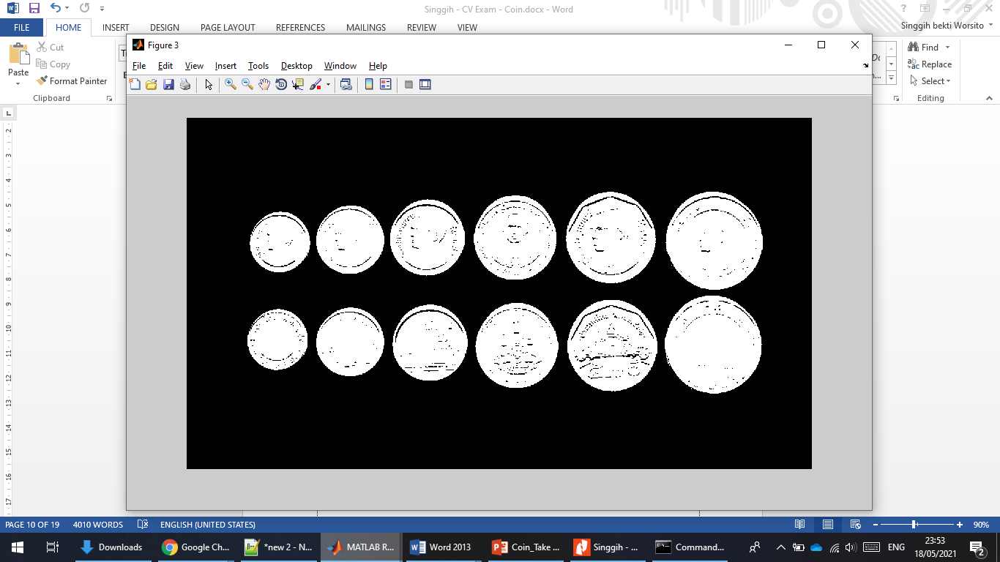
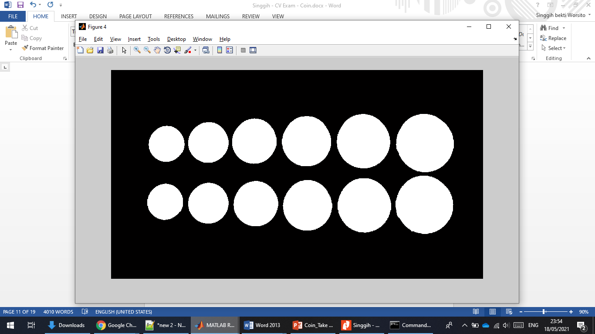
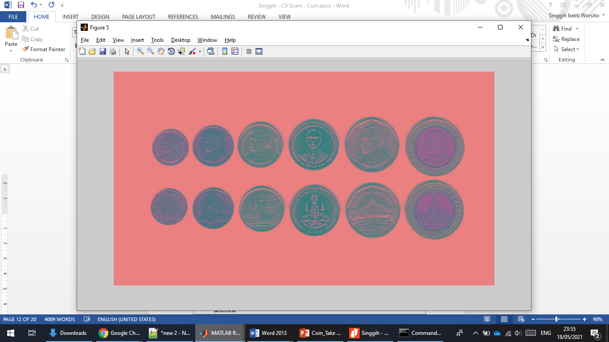
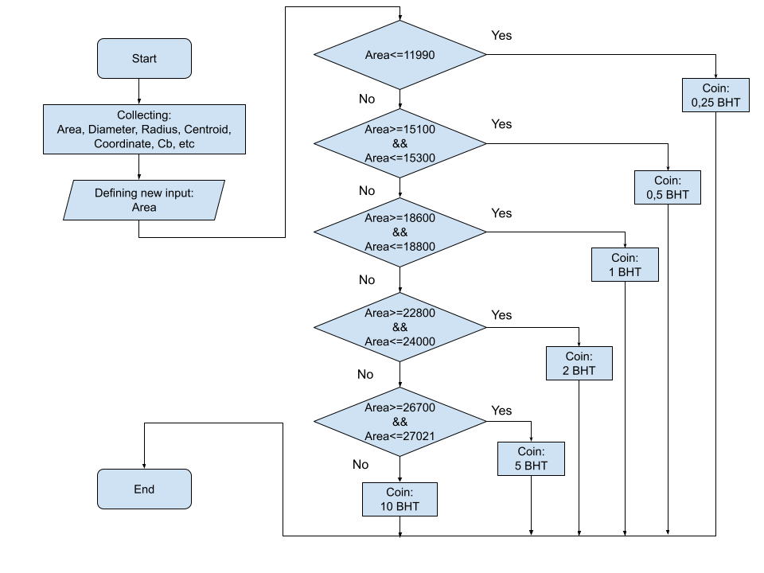
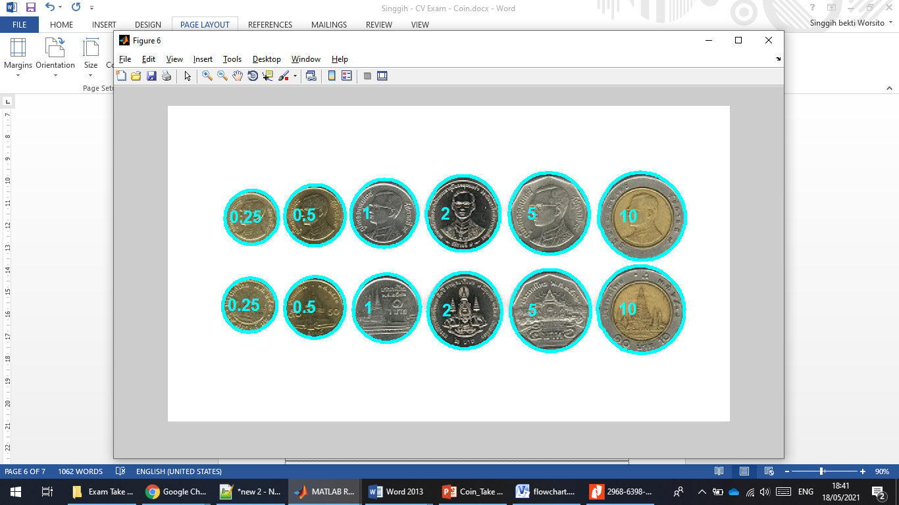

# Coin Identification
Purpose: 
- Design an algorithm to classify Thai coins into three classes of your choice, e.g., 
- The first class can be ‘One Baht’ coin, the second class can be ‘Ten Baht’ coin, the third class could be ‘Other coins.’

## 1. Preparation
The first step is to make sure the worksheet clear
```
%clear all variables from the current workspace
clc; clear; close all; warning off all; 
```
This is the image that I will use for this project

## 2. Read Image
Reading this picture can be done in various ways. The method commonly used to obtain images is by input via directories, webcams, and external cameras. On this system, I call files that are on my computer. To give a better view, we can create a good interface and easy to use as a form of development.

```
% 1. Read original image from the directory
% read image from the directory
img1=imread('C:\Users\Singgih\OneDrive - Chulalongkorn University\SMT 2\2102642 Computer Vision and Video Electronics\Exam Take Home\Coin\Coin_Take Home Exam _Project\1.JPG');
Img = img1; % re-defining the image
figure, imshow(Img); % showing the original image
```



## 3. Convert to Grayscale

Gray images are very common, in part because most display and image hardware today can only support 8-bit images. In addition, grayscale images are quite sufficient for many tasks, so there is no need to use more complex and difficult to process color images.
```
% 2. Convert rgb image color space to grayscale
% convert original image to gray image
Img_gray = rgb2gray(Img); 
% showing the converted image (gray image)
figure, imshow(Img_gray); 
```



## 4. Perform image segmentation

In this segmentation process, I do 2 things, namely converting grayscale image to binary and then I complete the image so that the object is one and the background is zero. It is very important to segment perfectly, so that the image can be more easily recognized.

```
% 3. Perform image segmentation using the 
% converting grayscale image to binary
bw = im2bw(Img_gray,graythresh(Img_gray));
% completes the image so that the object is one and the background is zero
bw = imcomplement(bw);
%showing the converted image (binary)
figure, imshow(bw); 

```


## 5. Morphological Operation

The morphological operations I do at this stage are to improve segmentation results. Initially, I did morphological operations to enhance the segmentation of the opening area to remove noise. Then, I use the function of filling holes to fill in the hollow object. Next, I close, which aims to make the object shape more smooth. Finally, I remove objects attached to the border (image edge). So that this process will produce a good result and be easier for further processing.


```
% 4. Perform morphological operations to improve segmentation results
% morphological operations to enhance the segmentation of the opening area to remove noise
bw = bwareaopen(bw,100);
% filling holes --> to fill in the hollow object
bw = imfill(bw,'holes');
% closing --> to make the object shape more smooth
str = strel('disk',5); 
bw = imclose(bw,str);
% remove objects attached to the border (image edge)
bw = imclearborder(bw);
%showing the segmented image
figure, imshow(bw); 

```


## 6. Convert to YCbCr
Identify each coin based on the color characteristics (in the YCbCr color space) and the specified size (object area). YCbCr is a color space. that means YCbCr is another color space just like RGB. YCrCb is a variation on the same color mapping. Initially, I used the function to confirm if the reading and recognition process based only on Diameter or Area was not working properly. I extracted the Cb component (Chrominance-blue). I use YCbCr in this project to identify coins that have a golden color. So, when there is a coin that is of the same value but has a different color and size, the system will still be able to work properly.
 
```
% 5. Identify each coin based on the color characteristics (in the YCbCr color space) and the specified size (object area)
 
% labeling of each object
[B,L] = bwlabel(bw);
% calculate the area and centroid of the object
stats = regionprops(B,'All');
% convert rgb image to YCbCr
YCbCr = rgb2ycbcr(Img);
% extract the Cb component (Chrominance-blue)
Cb = YCbCr(:,:,2);
% showing the YCbCr image
figure, imshow(YCbCr)
% showing rgb image (original image)
figure, imshow(Img);
hold on
% create a boundary for the detected coins
Boundaries = bwboundaries(bw,'noholes');

```




If we see carefully the image, there’s different color in 0.25, 0.5 and 10 baht coins, because they have golden color. Then I label every piece of information that has been obtained from the detected object. At this stage, I did the calculation of area, diameter, radius, and other variables as support for later processing, in the process of defining coins. This process is a way to find the character of each object detected by the system. Finally, I create a boundary for the detected coins, as a sign for objects that have been detected.

## 7. Calculating information and defining coins

This sixth stage is the stage that most determines whether the system is able to work properly or not. In a 'for' function, I do several processes inside such as defining the boundary, calculating the Cb value of each object, defining the label in each object based on Cb, calculate the area and centroid of each object, defining centers for all detected coins, defining centers for all detected coins, and obtaining the radius for each object. This stage indeed calls out a lot of the characteristics of each detected coin.

```
% 6. Calculating information and defining coins
% in this case, for n = 1 and/to n = number of objects
for n = 1:L
    % defining the boundary
    boundary = Boundaries{n};
    % calculate the Cb value of each object
    bw_label = (B==n);
    %defininf the label in each object based on Cb
    Cb_label = immultiply(Cb,bw_label);
    Cb_label = (sum(sum(Cb_label)))/(sum(sum(bw_label)));
    % calculate the area and centroid of each object
    % area for n-object
    Area = stats(n).Area
    % centroid for n-object 
    centroid = stats(n).Centroid; 
    
    % defining centers for all
    centers = stats.Centroid; 
    % obtaining diameters for each object
    diameters = mean([stats.MajorAxisLength stats.MinorAxisLength],2);
    % obtaining the radius for each object
    radii = diameters/2;
```



Then, based on the observations and what I have defined above, I compare the Area of each detected coin to define the coin. Initially, I planned to use multiple parameters as a form of defining each coin. However, fortunately, the system is able to work properly only based on the parameter "Area" of each detected object.


Based on the ‘Area’, I compute and define the class for each coin. Using the steps and process that have been explained above, the system can identify six coins.


```
        % comparing the Area for defining the coins based on the observation
        % nested if for performing the coins
        % if the "Area" is more that 11990 --> hence recognized as 0.25 coins <--> (11921-11980)
        if Area<=11990 nilai = 0.25; 
%(15100-15300)
        elseif Area>=15100 && Area<=15300   nilai= 0.5; 
%(18674-18709)
        elseif Area>=18600 && Area<=18800   nilai= 1; 
%(22908-23033) 
        elseif Area>=22800 && Area<=24000   nilai= 2;  
%(26782-26879)
        elseif Area>=26700 && Area<=27021  nilai= 5;  
        else
            nilai = 10; % for other definition = 10 baht coin 
        end
        % displays the boundary on the object
        plot(boundary(:,2), boundary(:,1), 'c', 'LineWidth', 4)
        % displays the coin value on the object centroid
        text(centroid(1)-50,centroid(2),num2str(nilai),...
            'Color','c','FontSize',20,'FontWeight','bold');
end

```



From that case, computer will understand about the image easily and inform us what image is that and the contain inside.

## For complete explaination
The explaination that I use as the report can be downloaded by clicking this link below:
https://drive.google.com/file/d/1C4fWlydquCPNVxWC0Ju3ItbUmv-5g9LY/view?usp=sharing
